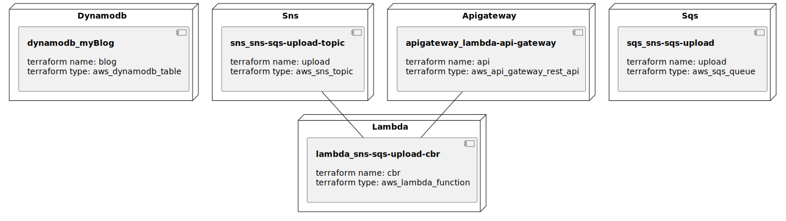

## Goal
Remind My note tag list

## Usage
1. Set Note Folder in `docker-compose.yml` 7 line.
2. Set variable (for serverless)
3. build
    - local
        - set environment for telegram
        - `export TELEGRAM_CHAT_ID=<Telegram chat id>`
        - `export TELEGRAM_TOKEN=<Telegram token>`
        - `docker-compose up`
    - serverless
        - set github secret for aws
        - `git push origin master`

#### TODO
- [x] parsing tag
- [x] send telegram
- [x] send sqs
- [x] sqs to lambda
- [X] make index file
- [X] tag, tagline match conflict content check
- [X] save tag with file
- [X] python recommend program, csv file to s3,
- [X] mget err check
- [X] cron every day
- [x] github action for make csv and upload to s3
- [ ] if search tag, show relate tag
- [ ] make tagline parsing algorithm better
- [ ] error monitoring
- [ ] github action terraform apply
- [ ] log to pull request message

#### Problem
- Even though small architecture. it has chaotic. hard to managing
- every service need fail control
- How to monitoring error?

#### Architecture (Serverless)
- ~~Parsing - elasticsearch - dynamodb - lambda - telegram~~
- github push - Parsing - s3
-    -> Execute with aws cron -> Get S3 CSV file -> Call lambda(CBR)
-    -> (sqs - lambda(telegram))
- And show remind list in web.
- And remind content + suggestion content
- [telegram bot with serverless](https://github.com/shdkej/my-telegram-bot)

#### Test (Local)
- ~~parsing - redis - elasticsearch - api - api~~
- docker-compose up -> parsing -> make csv file -> python recommender -> send telegram

#### Parsing data
- Note file
- Search History

#### Data Type
- [Tag Title, Tag body, File name, Hits, Updated date]
- Hash Map
- access from tag title. find tag body
- access from index
- don't need ordered, thread safe
- memory size is not priority
- keys can duplicates
- mutable

#### Mechanism
- state repetition
    - oldest update file send
    - 7-30-365 date
- Data
    - name
    - last read
    - last update
    - weight
- Content Based Recommend

### Infrastructure model

---
